# DESAFIOS E EXERCÍCIOS
## DESAFIOS
### 1. **Testlink** - *Desafio proposto pela GREat-UFC*

Implemente um caso de testes automatizado com **SELENIUM** ou **Robot Framework** para o seguinte cenário:

1. Acesse a página do [Testlink](https://testlink.org/)
```md
https://testlink.org/
```
2. Faça alguns assertions na página do Testlink;
3. Click no link para o GitHub do Testlink;
4. Faça alguns assertions na página para confirmar que é o github do Testlink;
5. (Opcional) Realizar uma pesquisa no GitHub e verificar resultado.

### 2. **Plataforma NL**
Os Alunos devem realizar testes E2E no site da [Plataforma NL](https://prpi.ifce.edu.br/nl/app_Login/) utilizando a biblioteca Selenium.
Esta atividade deve ser realizada em grupo.
<br>
Este desafio deve atender aos seguintes critérios:
1. **Casos de Testes:** É necessário que haja um arquivo com os casos de testes escritos;
2. **Selenium:** Os testes devem ser escritos com a ajuda da biblioteca do `Selenium`;
3. **GitHub:** O versionamento do código dever ser feito utilizando `git` e `github`;
4. **Padrão de Projeto:** O código deve ser escrito utilizando algum padrão de Projeto (de preferência o Page Object Model).

## EXERCÍCIOS
### 1. **ESCREVER EM INPUTs** - *Exercício dos formulários*

Implement um caso de teste automatizado com **Selenium** de forma que a automação siga os seguintes passos:

1. Acesse a página do [test](https://selenium.dunossauro.live/exercicio_06.html)
```md
https://selenium.dunossauro.live/exercicio_06.html
```
2. Preencha o primeiro formulário com um *nome* e uma *senha* e clique no botão *enviar*;<br>
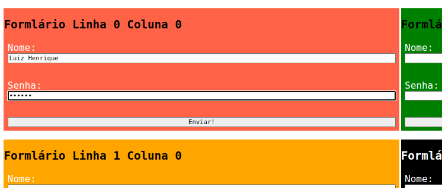

3. Verifique a resposta no canto inferior esquerdo da tela;<br>
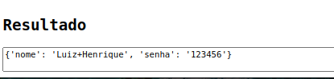

4. Repita este procedimento para todos os formulários.

### 2. **ESPERAS IMPLÍCITAS E EXPLÍCITAS** - *Exercício da barra de espera*

Crie dois arquivos e implemente dois casos de testes automatizado com **SELENIUM**, em um arquivo você deve implementar utilizando o **Implicit Wait** e, no outro, o **Explicit Wait**, para o seguinte cenário:

1. Acesse a página do [test](https://selenium.dunossauro.live/aula_09_a.html);
```md
https://selenium.dunossauro.live/aula_09_a.html
``` 
2. Espere o carregamento do botão **barrinha top**;<br>
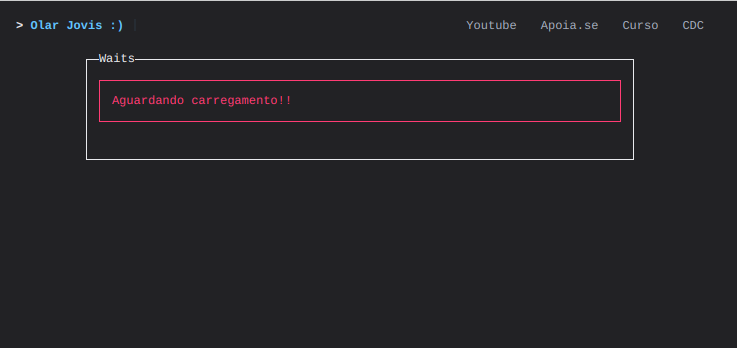

3. Clique no botão **barrinha top**;<br>
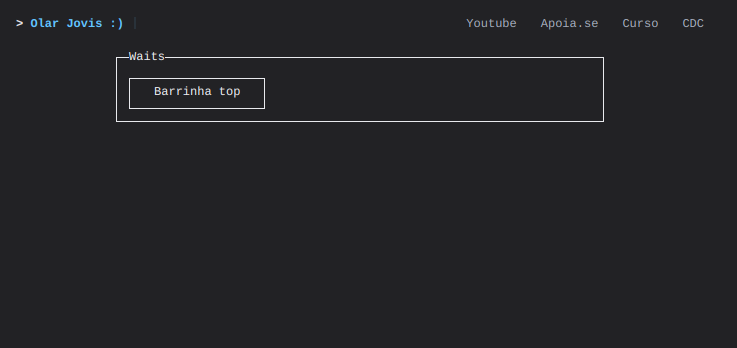

4. Espere a barra de load desaparecer;
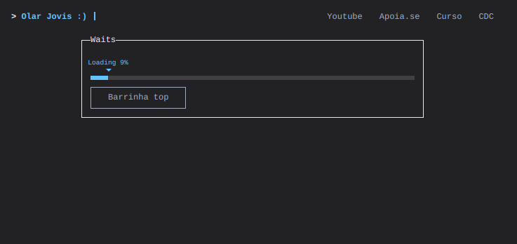

5. Verifique a mensagem de carregamento concluído utilizando *assert*<br>


### 2. **Alerts e Prompts** - *Exercício do site omayo*
#### 2.1 **ALERTs**
Implemente um caso de testes automatizado com **SELENIUM** para o seguinte cenário:

1. Acesse a página do [test](https://omayo.blogspot.com/);
```md
https://omayo.blogspot.com/
```
2. Preencha o login simples no final da página;<br>
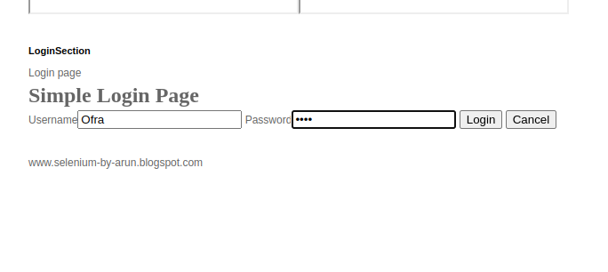

3. Dê um **assert** na mensagem no Alert e clique em **OK**;<br>
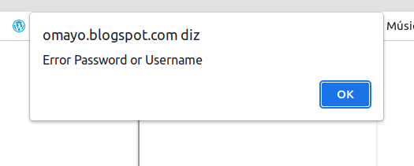

#### 2.2 **PROMPTs**
Implemente um caso de testes automatizado com **SELENIUM** para o seguinte cenário:

1. Acesse a página do [test](https://omayo.blogspot.com/);
```md
https://omayo.blogspot.com/
```
2. Clique no botão **get prompt** localizado no lado direito da tela;<br>
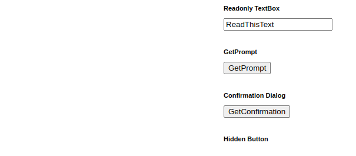

3. Escreva algo no **prompt** e aperte no botão **OK**<br>
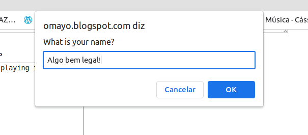

### 3. **ABAS E JANELAS** - *Exercício da função que pecorre os Ids das páginas abertas*

Implemente uma automação com **SELENIUM** de acordo com o que se pede:

1. Você deve fazer a automação abrir 5 abas ou janelas de sua escolha;
2. No seu arquivo deve possuir uma função com as seguintes características:

| AÇÃO        | DESCRIÇÃO      |
|:----------  |:----------------|
| input       | Uma string     |
| output      | A url da aba que contém a String passada por parâmetro

### 4. **PAGE OBJECT** - *Exercício da Saude Demo*

Implemente uma automação com SELENIUM de acordo com o que se pede:

1. Acesse o site do [Sauce Demo](https://www.saucedemo.com/)<br>
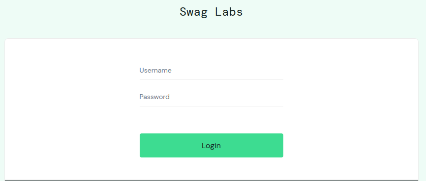
2. Realize o `Login` no sistema com as seguintes credenciais:

| USERNAME        | SENHA           |
|:----------      |:----------------|
| standard_user   | secret_sauce    |
3. Espanda o Menu-cascata e clique em Logout.<br>
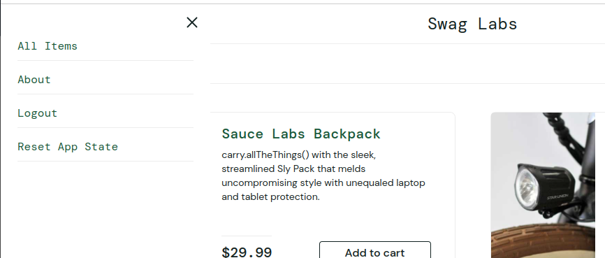


### 4. **Unittest Parte 1** - *Exercício do GitHub*
Utilizando o Selenium e o que a gente viu hoje sobre unittest faça um caso de teste automatizado com os seguintes passos:

1. Acesse o guitHub: https://github.com/LuizHenriqueVitorino
2. Clique na opção `Repositories`
3. Clique no Repositório `python-selenium-notas-de-aula`
4. Verifique se você está no repositório correto.